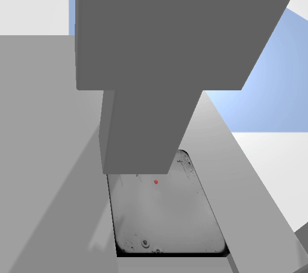

# Root Tip Inoculation Simulation with Computer Vision

## Overview

This simulation integrates a complete computer vision pipeline with a robotic controller to detect root tips on specimen plates and perform precise inoculation with a pipette.

Using a trained UNet model and morphological filters, root tips are detected from a top-down grayscale image of the plate. These positions are converted to robot coordinates and inoculated automatically with the robot arm.

## Key Features

- Trained UNet segmentation model for root detection  
- Morphological post-processing with proximity and position logic  
- Accurate pixel → mm → robot space coordinate conversion  
- PID-controlled robot movement to inoculate detected roots  
- Logic to prevent duplicate drops and filter invalid detections  
- GIF recording of the full inoculation sequence (see below)  

---

## Working Envelope of the Pipette

| Axis | Lower Limit | Upper Limit |
|------|-------------|-------------|
| X    | -0.1875     | 0.2531      |
| Y    | -0.1705     | 0.2197      |
| Z    | -0.0001     | 0.2895      |

---

## Demonstration

**Animation of Inoculation Process:**



This shows the robot detecting and inoculating all visible root tips based on the selected plate.


---

## Logic & Filtering

To ensure reliable performance, the system uses:

- Size thresholding: Removes small artifacts  
- Top & bottom Y cutoffs: Ensures only full roots are detected  
- Proximity suppression: Prevents overlapping root detections  
- 1mm XY tolerance: Pipette only drops when exactly over a root  
- One-drop-per-root control: No duplicate droplets are released  

---

## Dependencies

- Python 3.x  
- `pybullet`  
- `opencv-python`  
- `matplotlib`  
- `keras` / `tensorflow`  
- `skimage`, `skan`, `networkx`  
- `patchify`

Install:
```bash
pip install pybullet opencv-python matplotlib keras scikit-image networkx patchify
